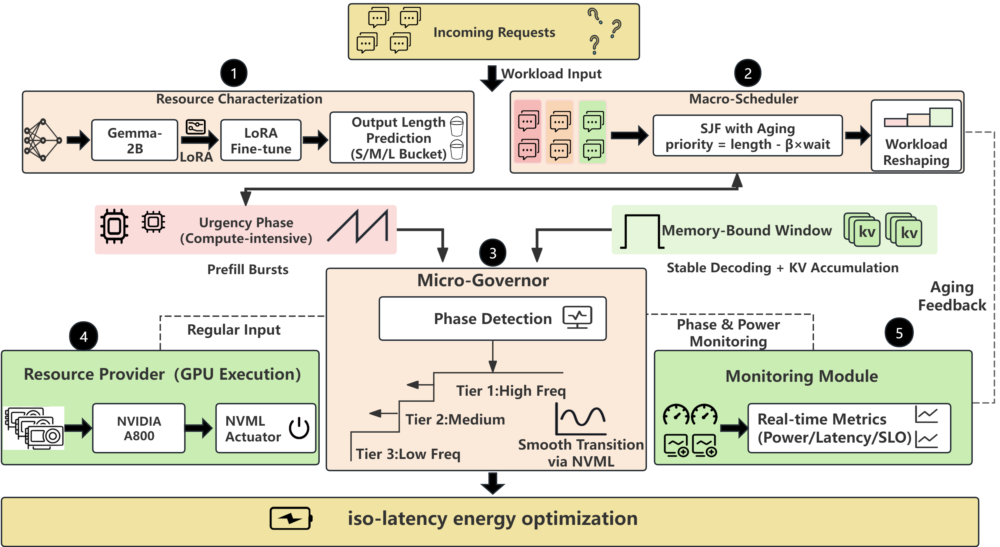

# EnergyServe

### Energy-Efficient LLM Inference Serving via Resource Characterization to Achieve Optimal Energy-Delay Product

[](LICENSE)
[](https://www.python.org/)
[](https://github.com/vllm-project/vllm)
[](#citation)

Official implementation of **EnergyServe**, a characterization-driven, cross-level
framework for energy-efficient Large Language Model (LLM) serving.

LLM inference is hindered by the **bimodal resource consumption** of generative
models: a compute-bound *prefill* phase versus a memory-bound *decoding* phase.
Continuous batching interleaves them, causing **phase interference** that forces
the GPU to hold peak frequency even during memory-bound intervals — wasting energy.
EnergyServe proactively **reshapes the workload** into ordered, resource-homogeneous
phases that hardware scaling can safely exploit, aligning software scheduling with
real-time hardware power states for fine-grained DVFS.

<p align="center">
  
</p>

## Highlights

EnergyServe couples three stages into a closed loop:

1. **Resource Characterization** (Perception) — a lightweight LoRA adapter on
   Gemma-2B predicts per-request resource demand from the prompt alone, exposing
   "deceptive short-input / long-output" requests *before* admission.
2. **Macro-Scheduling — EAPS** (`energyserve/macro/`) — an Expected-cost-guided
   Anti-starvation Priority Selection policy reorders the queue: prefills are
   dispersed, decodes are aggregated into stable memory-bound windows.
3. **Micro-Governance — Adaptive DVFS** (`energyserve/micro/`) — a token-step,
   NVML-driven governor reads the live batch state and downscales voltage inside
   those windows, scaling power to demand instead of reacting to raw utilization.

Across four GPUs spanning data-center to prosumer tiers (A800, A100, A6000, V100),
EnergyServe reduces **energy by up to 26.9%** and **EDP by up to 30.7%** versus
vLLM, improves **median latency (P50) by up to 12.1%**, and raises **SLO attainment
by 2.5–5.4 points** — the only method below the baseline on both energy and EDP
on every device.

## Repository Structure

```text
EnergyServe/
├── energyserve/            # Core framework
│   ├── core/               # Async engine + request orchestration (Algorithm 3)
│   ├── macro/              # EAPS macro-scheduler: SJF + aging (Algorithm 1)
│   ├── micro/              # Adaptive DVFS micro-governor (Algorithm 2)
│   └── utils/              # Logger, energy monitor (NVML), analyzer
├── baselines/              # Five reproduced baselines (scheduler + governor)
│   ├── vllm_base/          #   Vanilla vLLM (FCFS @ peak power)
│   ├── fixed_power/        #   Static 150 W power cap
│   ├── utilization_dvfs/   #   Reactive utilization-based DVFS
│   ├── fastserve/          #   Skip-join / shortest-input preemptive scheduling
│   └── dynamollm/          #   Phase-aware power policy
├── scripts/                # Entry points (train, eval, generate, serve, plot)
├── configs/                # YAML configs (core_config.yaml is the runtime config)
├── docs/DATA.md            # Dataset download & workload reproduction
├── tools/                  # Result aggregation helpers
└── assets/                 # Figures
```

> **Note.** Datasets and model weights are **not** included in this repository.
> See [`docs/DATA.md`](docs/DATA.md) for download and preprocessing instructions.

## Getting Started

### 1. Installation

Requires an NVIDIA GPU (Ampere or newer recommended, e.g. A800/A100) with the
NVIDIA driver and NVML available; power capping uses `nvidia-smi -pl` / NVML.

```bash
git clone https://github.com/<your-org>/EnergyServe.git
cd EnergyServe
pip install -r requirements.txt
```

Set your base model path in `configs/core_config.yaml` (`system.base_model_path`,
default `Meta-Llama-3-8B-Instruct`) — download the weights separately from
Hugging Face.

### 2. Data & Workloads

Download the datasets (Alpaca, Dolly-15k, LMSYS-Chat-1M) and build the
Poisson-arrival workloads — see [`docs/DATA.md`](docs/DATA.md):

```bash
# Build a serving workload (Poisson arrivals, lambda=50 req/s by default)
python scripts/generate_workload.py --dataset lmsys

# (Optional) Inspect the request-type distribution (paper Table 2)
python scripts/analyze_workload_distribution.py --dataset lmsys
```

### 3. Resource-Characterization Model

```bash
# Train the per-request resource predictor (Gemma-2B + LoRA)
python scripts/train_predictor.py --dataset dolly

# Evaluate bucket-classification accuracy
python scripts/eval_predictor.py --dataset dolly
```

### 4. Serving Experiments

```bash
# EnergyServe (ours): EAPS scheduling + adaptive DVFS
python scripts/run_serving.py --dataset lmsys

# Baselines: vllm_base | fixed_power | utilization_dvfs | fastserve | dynamollm
python scripts/run_baselines.py --mode dynamollm --dataset lmsys
```

Per-request and time-series metrics are written to `outputs/results/`.

### 5. Figures

```bash
python scripts/plot_paper_figs.py          # power profiles, radar, latency CDF
python tools/aggregate_results.py          # combine per-GPU result CSVs
```

## Results

End-to-end performance on **LMSYS-Chat-1M** (λ=50 req/s), all baselines reproduced
as scheduling/governance policies inside the same vLLM-based engine to isolate
algorithmic effects. Representative data-center GPU (A800); full per-GPU tables are
in the paper.

| Method            | EDP (×10⁶) ↓ | Avg Lat (s) ↓ | P50 (s) ↓ | SLO (%) ↑ | Energy (J) ↓ |
| :---------------- | :----------: | :-----------: | :-------: | :-------: | :----------: |
| vLLM (FCFS)       |     3.55     |     65.12     |   66.13   |   87.20   |    54,466    |
| FastServe         |     3.18     |     59.32     |   55.79   |   87.90   |    53,583    |
| Fixed Power 150 W |     3.34     |     93.54     |   95.06   |   81.50   |    35,698    |
| DynamoLLM         |     3.21     |     63.60     |   64.11   |   87.05   |    50,467    |
| Utilization DVFS  |     3.32     |     65.05     |   66.74   |   86.95   |    50,975    |
| **EnergyServe**   |   **2.46**   |     61.79     |   58.11   | **90.60** |    39,796    |

On the A800 this is a **30.7% EDP** and **26.9% energy** reduction over vLLM while
*raising* SLO attainment and keeping latency at or below the baseline. The benefit
widens on memory-constrained prosumer GPUs (A6000, V100). EDP = E_total × Avg-latency.

## Citation

This work is currently under review. If you find it useful, please cite:

```bibtex
@article{wang2025energyserve,
  title   = {EnergyServe: Energy-Efficient LLM Inference Serving via Resource
             Characterization to Achieve Optimal Energy-Delay Product},
  author  = {Wang, Zhuopeng and Xu, Minxian and Wang, Yan and Ye, Kejiang and
             Liu, Zhenkun and Buyya, Rajkumar},
  journal = {IEEE Transactions on Services Computing (under review)},
  year    = {2025}
}
```

## License

Released under the [Apache License 2.0](LICENSE).
